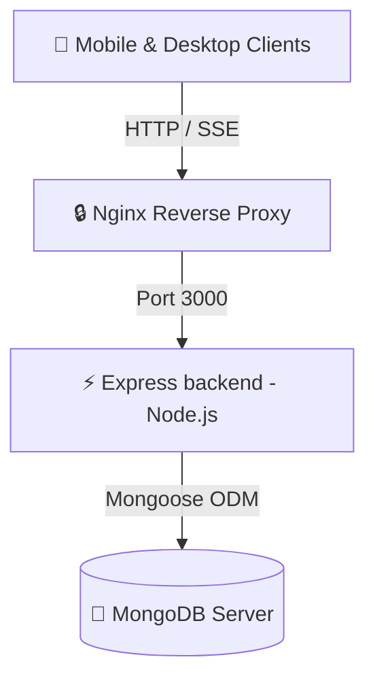
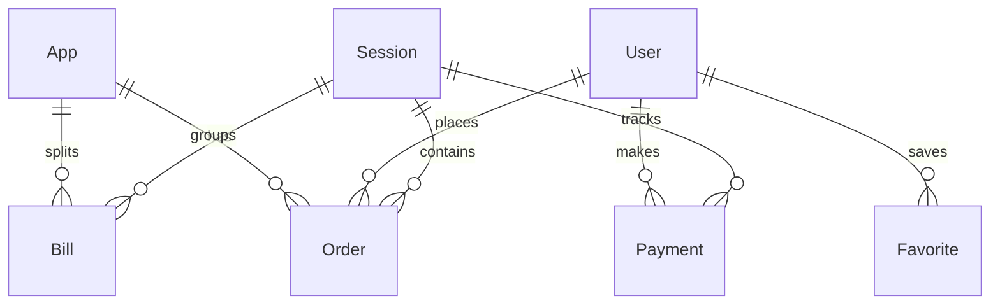

# 🏗️ GroupCart System Architecture

This document describes the design, components, database architecture, and backend engines of the GroupCart application.

---

## 🗺️ High-Level Topography

GroupCart is built on a containerized three-tier web application architecture:



* **Client Layer**: Mobile-first Single Page Application (SPA) written in Vanilla HTML5, CSS3, and JavaScript. Consumes REST APIs and listens to real-time events via Server-Sent Events (SSE).
* **Reverse Proxy Layer**: Alpine-based Nginx proxy handling standard HTTP caching, Server-Sent Events (SSE) streaming overrides, and secure reverse proxy forwarding.
* **Backend Application Layer**: Node.js runtime executing an Express.js server. Includes the core business logic: product web scraper, billing split engines, payment ledger verification, and real-time event broadcasting.
* **Database Layer**: MongoDB instance storing data using Mongoose ODM schemas.

---

## 🗃️ Database Schema Architecture (MongoDB)

All schemas use custom generated random alphanumeric IDs (via a helper `generateId()`), disabling virtual Mongoose identifiers (`{ id: false }`).

### Entity Relationship Diagram



### 1. `User` Schema
Tracks logged-in participants and administrators.
* `id` (String, unique, indexed): Custom alphanumeric identifier.
* `name` (String): Display name of the user. Case-insensitive queries are supported for logins.
* `isAdmin` (Boolean, default: `false`): Restricts access to administrative actions.
* `createdAt` (Date).

### 2. `App` Schema
Represents supported food delivery or shopping platforms (e.g., Blinkit, Swiggy, Zepto, Instamart).
* `id` (String, unique, indexed): App name slug (e.g. `blinkit`).
* `name` (String): Human-readable title.
* `color` (String): Theme hex code color for UI elements.
* `icon` (String): Icon filename or SVG code.

### 3. `Order` Schema
Represents single items added by users to an active or historical session.
* `id` (String, unique, indexed).
* `sessionId` (String, indexed): Associated ordering session.
* `userId` (String, indexed) & `userName` (String).
* `appId` (String, indexed): Associated shopping platform.
* `link` (String): Product URL (optional).
* `productName` (String): Item title.
* `qty` (Number, default: `1`).
* `estimatedPrice` (Number): Individual item price.
* `status` (String, default: `'pending'`): Enums: `['pending', 'confirmed', 'out-of-stock', 'returned', 'not-delivered']`.
* `statusNote` (String): Reason for status changes (e.g., "Replaced with 500ml milk").
* `statusUpdatedBy` (String) & `statusUpdatedAt` (Date).
* `adminModified` (Boolean) & `adminModifiedBy` (String) & `adminModifiedAt` (Date).

### 4. `Bill` Schema
Records the actual checkout invoice value for a specific app once ordered.
* `id` (String, unique, indexed).
* `sessionId` (String, indexed).
* `appId` (String): Associated platform.
* `actualAmount` (Number): Final amount paid on invoice (includes delivery, taxes, packaging, and promo discounts).
* `settledAt` (Date).

### 5. `Session` Schema
Tracks ordering rounds. Only one session is `active` at any given time.
* `id` (String, unique, indexed).
* `name` (String): Custom name (e.g. "Pizza Party"). Defaults to an Indian Standard Time (IST) timestamp format: `Session DD/MM/YYYY HH:MM`.
* `active` (Boolean, default: `true`): True indicates the session is ongoing.
* `status` (String, default: `'adding'`): Enums: `['adding', 'locked', 'ordered', 'delivered', 'settled']`.
* `splitMode` (String, default: `'proportional'`): Enums: `['proportional', 'equal', 'custom']`.
* `customSplits` (Map of String -> Number): Manual rupee amounts mapping `userId` to split values.
* `freeDeliveryThresholds` (Map of String -> Number): Free delivery target amounts for platforms.
* `createdAt` (Date) & `settledAt` (Date).

### 6. `Favorite` Schema
Allows users to star items. Features a compound index preventing duplicate starred items per user.
* `id` (String, unique, indexed).
* `userId` (String, indexed).
* `appId` (String).
* `productName` (String) & `estimatedPrice` (Number) & `link` (String).
* `createdAt` (Date).
* **Compound Index**: `{ userId: 1, appId: 1, productName: 1 }` with `{ unique: true }`.

### 7. `Payment` Schema
Keeps track of billing settlements.
* `id` (String, unique, indexed).
* `sessionId` (String, indexed).
* `userId` (String, indexed) & `userName` (String).
* `amount` (Number): Total calculated rupee amount the user owes.
* `markedPaidAt` (Date): Filled when user triggers "I Have Paid".
* `confirmedByAdmin` (Boolean, default: `false`).
* `confirmedAt` (Date) & `confirmedBy` (String).

### 8. `Settings` Schema
Global key-value options.
* `upiId` (String): Administrative UPI ID for receiving payments.

---

## ⚡ Real-Time Synch Stream (Server-Sent Events)

To prevent constant REST polling, GroupCart uses **Server-Sent Events (SSE)** via `/api/events` to push database updates directly to connected browser clients.

### Connection Lifecycle Management
1. When a client mounts the frontend app, it initializes an `EventSource('/api/events')`.
2. The Express server sets custom HTTP Headers:
   ```http
   Content-Type: text/event-stream
   Connection: keep-alive
   Cache-Control: no-cache
   ```
3. The Express handler adds the client's connection handle to a global `sseClients` Set.
4. If the connection is broken or closed (e.g., mobile browser goes to sleep), the `req.on('close')` event triggers, removing the client connection from the Set to prevent memory leaks.

### Broadcast Mechanics
Whenever database writes occur on the backend (creating orders, updating payment badges, settling bills), the handler calls `broadcastSSE(event, data)`. This stringifies payloads and pushes them down the SSE pipe matching specific Event Types (e.g., `order-added`, `payment-updated`, `session-status-changed`).

---

## 🔎 cheerio Product Web Scraper

The scraper runs on `/api/scrape-url` using the `cheerio` library to parse shared URLs. To prevent network hanging, the fetch requests incorporate an `AbortSignal.timeout(10000)` safety window. 

The parser extracts item names and estimated prices using a strict fallback hierarchy:

1. **JSON-LD Schema Extraction**: Scans for `<script type="application/ld+json">`. Loops through JSON blocks to identify `@type === 'Product'` schemas. Reads the name and price from `.name` and `.offers.price` or `.offers[0].price`.
2. **OpenGraph & Twitter Meta Tags**: If JSON-LD is missing, the scraper reads name and title from `<meta property="og:title">` or `<meta name="twitter:title">` or `<title>`. Text suffixes (like ` | Blinkit` or ` - Swiggy`) are automatically stripped.
3. **Price Metadata Fields**: Locates `<meta>` tags matching `product:price:amount`, `og:price:amount`, or `product:sale_price:amount`.
4. **DOM Rupee Scanner**: Scans all DOM leaf text nodes matching `/^₹\s*(\d+(?:\.\d{1,2})?)$/` or `/^Rs\.?\s*(\d+(?:\.\d{1,2})?)$/`, choosing the minimum non-zero value.
5. **Raw String Regular Expression Backup**: Performs a raw case-insensitive string regex search on the raw HTML block matching `/["']price["']\s*:\s*["']?(\d+(?:\.\d{1,2})?)["']?/i`.

---

## 🧮 Settlement Calculation Engine

### 1. Proportional Split (with Smart Decimal Rounding)
Standard billing splits run into floating-point division issues, resulting in fractions of paisas that don't add up to the exact checkout invoice. The backend resolves this using a smart rounding adjustment engine:
1. Calculates raw proportional decimal costs for each user.
2. Truncates/rounds each share to the nearest integer (`Math.round()`) and sums them up.
3. Computes the difference: `diff = bill.actualAmount - roundedSum`.
4. If `diff != 0` (e.g. 1 rupee or paisa off), the engine identifies the user whose raw decimal share had the highest fractional remainder (`remainder = raw - Math.floor(raw)`) and adjusts their bill by adding/subtracting the difference `diff`.

### 2. Equal Split
Divides the total actual platform invoice value equally among all active participants.
- If there is an indivisible remainder, the engine distributes the remainder 1 rupee at a time starting from the first active user.
- To map items correctly on individual apps, the user's flat share is redistributed back to apps proportionally to their original estimated order ratio on that app.

### 3. Custom Split
Calculates costs using custom absolute values provided manually by the administrator. Validates that the sum of custom inputs does not exceed the total billing invoices.
