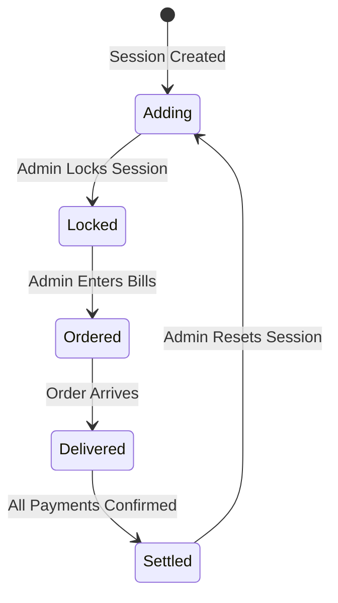
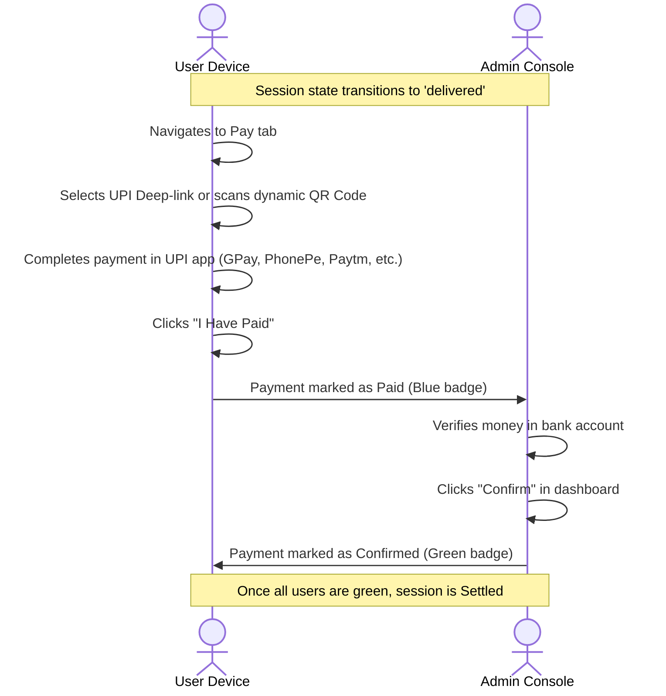

# 🔄 GroupCart Application Workflows

This document outlines the workflows, state transitions, and user journeys of the GroupCart application.

---

## 🏁 Session Lifecycle State Machine

An ordering session progresses through five states. The transitions are controlled by the administrator and broadcast in real-time to all clients.



### 1. `adding` (People Adding Items)
* **Description**: The ordering round is open. Users join the session and add items.
* **Client Behavior**: "Add Item" button is visible. Users can delete or edit their own items.
* **Admin Actions**: Can configure platform free delivery thresholds.

### 2. `locked` (Locked for Ordering)
* **Description**: The administrator is currently placing the combined order on the delivery platform.
* **Client Behavior**: Read-only access. The "Add Item" floating button is hidden. Users cannot delete or modify items.
* **Admin Actions**: Admin reviews items, adjusts final prices to match actual store prices, and marks items as "Confirmed" or "Out of Stock".

### 3. `ordered` (Placed / Ordered)
* **Description**: The order has been submitted and paid for on the delivery app.
* **Client Behavior**: Read-only access.
* **Admin Actions**: Admin enters the actual checkout invoice amount for each platform (including delivery fees, discounts, packaging) and selects the Split Mode (Proportional, Equal, Custom).

### 4. `delivered` (Delivered)
* **Description**: The food/grocery has arrived at the location.
* **Client Behavior**: The **Pay (💰)** tab becomes active. Users check their calculated share, scan the UPI QR code (or click a deep link), make the payment, and click **"I Have Paid"**.
* **Admin Actions**: Admin monitors payment statuses under the "Confirm Payments" panel.

### 5. `settled` (Settled)
* **Description**: All payments have been confirmed by the administrator.
* **Client Behavior**: Read-only history state. A session archive is created.
* **Admin Actions**: Admin resets the session, triggering the system to archive historical documents and open a fresh `adding` session.

---

## 🛍️ User Workflow

### 1. Registration & Login
GroupCart does not require traditional password logins for standard users:
1. User enters their name (e.g. `Bob`).
2. The server runs a collation-aware query to check if the user exists (resolving case duplicates like `BOB` vs `bob`).
3. If not, a new `User` document is created.
4. User information is stored in local storage for subsequent auto-login.

### 2. Adding Items
Users can add items to the active session using three mechanisms:
* **Manual Add**: User taps `+`, chooses platform, enters item title, quantity, and estimated price.
* **Android PWA Share Target**: User shares a product page directly from Swiggy/Zomato/Blinkit. The Android Chrome PWA catches the shared URL parameters, calls `/api/scrape-url` to extract item details, and pre-fills the form.
* **iOS Apple Shortcut Workaround**: User triggers the iOS share sheet, Safari opens the web app with `?text=<URL>`, and the scraper parses and pre-fills the form.

---

## 💳 Payment & UPI Settlement Workflow

Once the admin inputs actual bills, the calculation engine publishes individual invoices.



### UPI Dynamic QR & Deep Link Generation
If the admin has configured their UPI ID in settings, the **Pay** tab displays:
- **Mobile Deep-Links**: Support buttons for Google Pay, PhonePe, Paytm, BHIM, Slice, and CRED using the custom UPI URI syntax:
  ```text
  upi://pay?pa=admin@upi&pn=AdminName&am=123.45&tn=GroupCart%20Order
  ```
- **Dynamic QR Code**: Generated on the client side calling the `api.qrserver.com` API pre-filled with the calculated payment amounts.
- **Remarks Metadata**: Pre-fills payment messages in the format `DD/MM/YYYY - X items - Rs. Y` to assist administrators in reconciling bank statements.
- **"I Have Paid" Trigger**: Pushes a payment update, setting status to `Paid` (blue badge) in real-time.

---

## 🛠️ Admin Dashboard Workflow

### 1. Admin Login
Admin checks the "Login as Admin" box and enters the password (verified against the `ADMIN_PASSWORD` environment variable).

### 2. Order Management
The admin manages items using the Order Board:
- **Confirm**: Confirms individual items (stating they are successfully added to the store checkout cart).
- **Confirm All**: Single-click confirmation of all pending items on a particular delivery platform.
- **Out of Stock**: Marks missing items, triggering a prompt to explain why (e.g. "Substituted with smaller pack").
- **Edit Prices**: Modifies item prices inline to match the store's current values.

### 3. Invoice Entries
Admin inputs the actual total checkout values per platform. The split engine processes individual shares dynamically.

### 4. Settlement Confirmation
When users tap "I Have Paid", the admin console highlights their status. After checking their bank records, the admin clicks **Confirm**, which changes the user's status to **Confirmed** (green badge).
